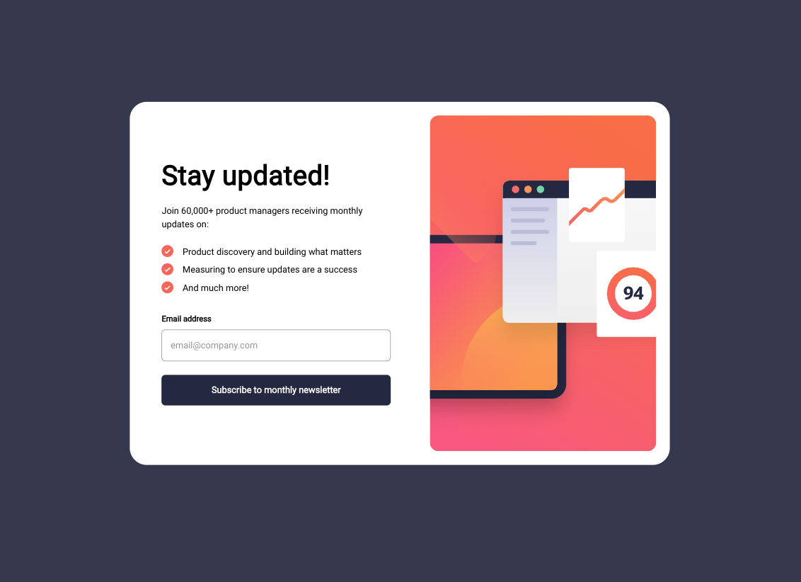

# Frontend Mentor - Newsletter sign-up form with success message solution

This is a solution to the [Newsletter sign-up form with success message challenge on Frontend Mentor](https://www.frontendmentor.io/challenges/newsletter-signup-form-with-success-message-3FC1AZbNrv). Frontend Mentor challenges help you improve your coding skills by building realistic projects. 

## Table of contents

- [Overview](#overview)
  - [The challenge](#the-challenge)
  - [Screenshot](#screenshot)
  - [Links](#links)
- [My process](#my-process)
  - [Built with](#built-with)
  - [What I learned](#what-i-learned)
  - [Useful resources](#useful-resources)
- [Author](#author)


## Overview

### The challenge

Users should be able to:

- Add their email and submit the form
- See a success message with their email after successfully submitting the form
- See form validation messages if:
  - The field is left empty
  - The email address is not formatted correctly
- View the optimal layout for the interface depending on their device's screen size
- See hover and focus states for all interactive elements on the page

### Screenshot




### Links

- Solution URL: https://www.frontendmentor.io/solutions/responsive-newsletter-form-using-react-scss-and-parcel-PAPWSTJiwQ
- Live Site URL: https://ramikoff.github.io/newsletter-sign-up-with-success-message-main/

## My process

### Built with

- Semantic HTML5 markup
- SASS/SCSS
- Flexbox
- Mobile-first workflow
- [React](https://reactjs.org/) - JS library
- [Parcel](https://parceljs.org/) - Bundler


### What I learned

- How to Create HTML Forms
- Deploying a React App to GitHub Pages
- How To Set Up a React Project With Parcel


Some code I'm proud of:

HTML:
```HTML
<form action="assets/js" className="form">

  <label className="heading">
    Stay updated!
  </label>
  <p className="lead">
    Join 60,000+ product managers receiving monthly updates on:
  </p>

  <ul className="list">
    <li className="list-item">
      
      <span>Product discovery and building what matters</span>
    </li>
    <li className="list-item">
      
      Measuring to ensure updates are a success
    </li>
    <li className="list-item">
      
      And much more!
    </li>
  </ul>
  <div className="input-label">
    <label htmlFor='email'>Email address</label>  {error ? <span className="error-message">Valid email required</span> : ""}
  </div>
  <input type="text" name="email" id="email" value={inputValue} onChange={onInputChange}
         className={error ? "input input--error" : "input"}/>

  <Button onClick={onSubscribe} className={"btn"} text={"Subscribe to monthly newsletter"}/>

</form>
```
SCSS:
```SCSS
@mixin md {
  @media screen and (min-width: $md) {
    @content;
  }
}

.container {
  display: flex;
  flex-direction: column;
  justify-content: space-between;
  padding: 1rem;
  background-color: $white;

  @include md {
    padding: 1.5rem;
    max-width: 1200px;
    transform: translateY(30%);
    border-radius: 30px;
  }

  &--md-large {
    padding: 0;

    @include md {
      padding: 1.5rem;
      flex-direction: row-reverse;
      max-width: 1200px;
    }

  }


  &--md-small {
    @include md {
      width: 500px;
      height: 500px;
      flex-direction: column;
      padding: 3rem 4rem;
    }
  }
}
```
JS:
```JS
 const onSubscribe = (event) => {
  event.preventDefault()
  isFormSuccessPullData(validateEmail(inputValue), inputValue)
  if (validateEmail(inputValue) === false)
    setError(true)
}
```


### Useful resources

- [JS Helper](https://www.youtube.com/watch?v=NJcX7leVjD0) - This helped me to deploy my App to GitHub Pages.
- [https://developer.mozilla.org/](https://developer.mozilla.org/)


## Author

- GutHub - [Ramil Novruzov](https://www.your-site.com)
- Frontend Mentor - [@ramikoff](https://www.frontendmentor.io/profile/ramikoff)
- LinkedIn - [@ramilnovruzov](https://www.linkedin.com/in/ramilnovruzov/)


